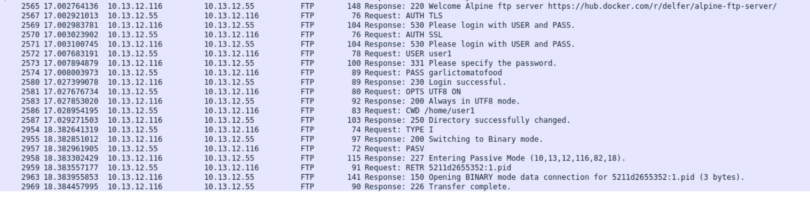

# Protokollanalyse

## 1. Was ist FTP?
>"Das File Transfer Protocol [fʌɪl trɑːnsˌfəˌprəʊtəkɒl] (FTP, englisch für „Dateiübertragungsprotokoll“) ist ein Netzwerkprotokoll zur Übertragung von Dateien über IP-Netzwerke. FTP ist im RFC 959 von 1985 spezifiziert, zustandsbehaftet und in der Anwendungsschicht (Schicht 7) des OSI-Schichtenmodells angesiedelt. Es wird benutzt, um Dateien vom Client zum Server hochzuladen, vom Server zum Client herunterzuladen oder clientgesteuert zwischen zwei Servern zu übertragen (File eXchange Protocol). Außerdem können mit FTP Verzeichnisse angelegt sowie Verzeichnisse und Dateien umbenannt oder gelöscht werden." - [Wikipedia](https://de.wikipedia.org/wiki/File_Transfer_Protocol)

### 1.1 Risiken
Wenn `FTP` anstatt `SFTP` verwendet wird, werden die Daten unverschlüsselt übertragen. \
Auch kann es ein Risiko sein, Benutzer:innen zu hohe bzw falsche Berechtigungen zu geben.

## 2. Wichtige Befehle

### USER:
Dieser Befehl wird verwendet, um den Benutzernamen des Clients an den FTP-Server zu übermitteln. Der Server antwortet mit einer Bestätigung oder einer Aufforderung zur Eingabe des Passworts. Der Befehl ist der erste Schritt im Authentifizierungsprozess.

### PASS:
Nach dem Befehl USER sendet der Client den PASS-Befehl, um das Passwort für den angegebenen Benutzernamen zu übermitteln. Der Server überprüft die Anmeldeinformationen und gewährt oder verweigert den Zugriff auf die FTP-Sitzung.

### LIST:
Mit dem LIST-Befehl kann der Client eine Liste der Dateien und Verzeichnisse im aktuellen Verzeichnis des Servers anfordern. Der Server sendet eine detaillierte Auflistung der Inhalte zurück, die dem Client angezeigt werden kann.

### RETR:
Der RETR-Befehl wird verwendet, um eine Datei vom Server auf den Client herunterzuladen. Der Client gibt den Namen der Datei an, die er herunterladen möchte, und der Server überträgt die Datei über die Datenverbindung.

### STOR:
Im Gegensatz zu RETR wird der STOR-Befehl verwendet, um eine Datei vom Client auf den Server hochzuladen. Der Client gibt den Namen der Datei an, die er hochladen möchte, und der Server empfängt die Datei über die Datenverbindung.

## Protokollanalyse

Paket 2565 ist eine `Response`-Willkommensnachricht des FTP-Servers \
Paket 2567 ist eine `Request` des clients um die Authentifizierung über transport layer security (TLS) abzuwickeln. \
Paket 2569 und 2571 sind `Response`-Nachrichten des FTP-Servers die ein Login des Benutzers anfragen. \
In Paket 2572 und 2574 sind die Login-Daten des Benutzers enthalten. \
Paket 2573 ist eine `Reponse`-Nachricht des Servers, um nach dem Passwort zu fragen \
Paket 2574 ist eine `Reponse`-Nachricht des Servers, die über einen erflogreichen Loginversuch berichtet \
In Paket 2586 und 2587 wird in ein Unterverzeichnis gewechselt.\
Paket 2959 ist eine `Request` des clients, die Datei `5211d2655352:1.pid` herunterzuladen. \
In Paket 2963 wird der Transfer gestartet \
In Paket 2969 ist eine Bestätigung, das der Transfer erfolgreich durchgeführt wurde. 

## Quellen
https://de.wikipedia.org/wiki/File_Transfer_Protocol